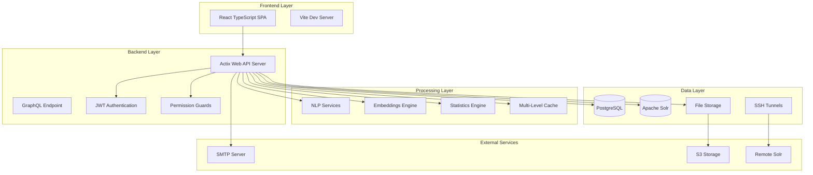
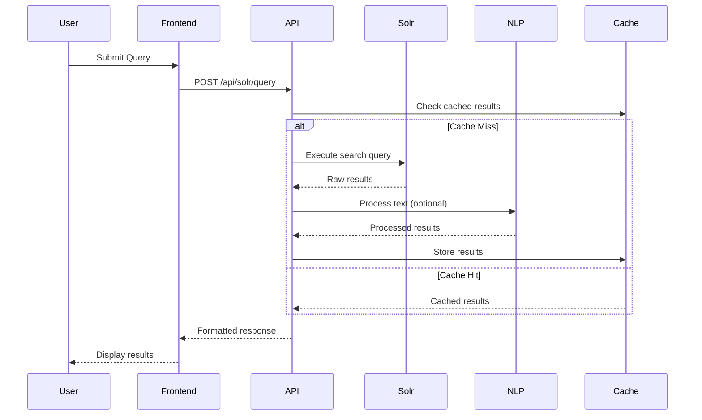
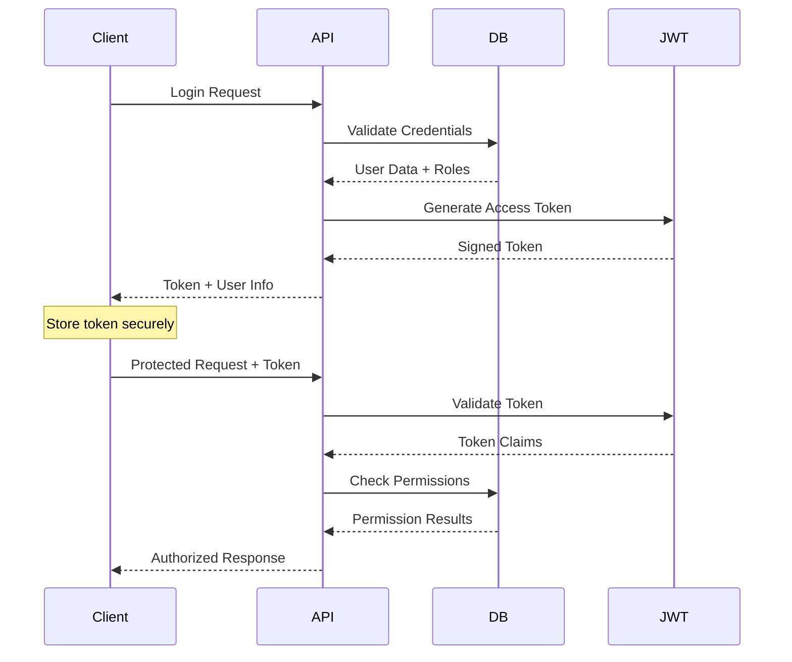
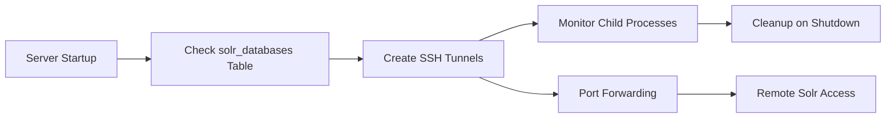
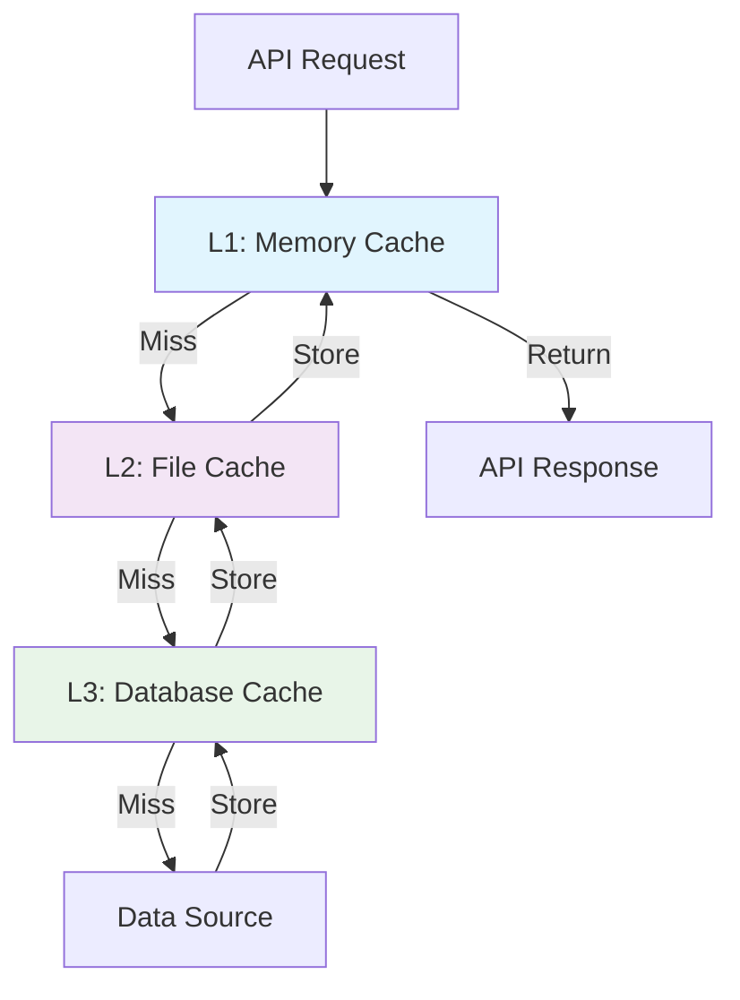
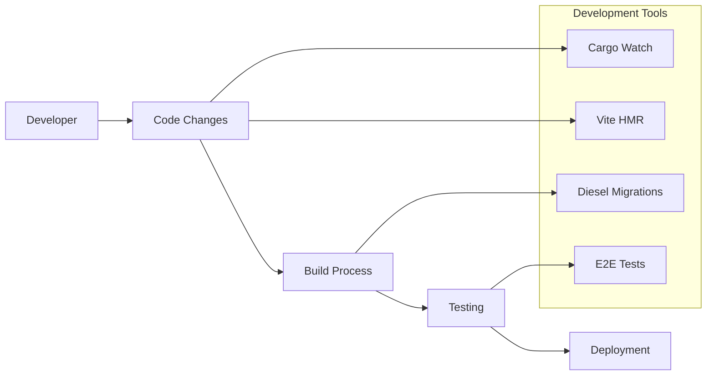

# HistText Architecture Documentation

## Overview

HistText is a multi-tier web application designed for large-scale historical text analysis. The architecture follows a microservices-oriented approach with clear separation between data storage, processing, and presentation layers.

## System Architecture



## Component Architecture

### 1. Frontend Architecture (React TypeScript)

#### Core Structure
```
frontend/src/
├── containers/          # Page-level components
│   ├── HistText/       # Main analysis interface
│   ├── admin/          # Administrative panel
│   ├── LoginPage.tsx   # Login authentication
│   ├── RegistrationPage.tsx # User registration
│   └── other auth pages # Password recovery, activation
├── components/         # Reusable UI components
│   ├── ui/            # Generic UI elements
│   └── specific/      # Domain-specific components
├── hooks/             # Custom React hooks
├── types/             # TypeScript definitions
└── bundles/           # Entry points
```

#### State Management
- **Apollo Client**: Primary state management for GraphQL and server state
- **React Query v3**: Additional server state caching and synchronization
- **Zustand v5**: Global application state management
- **Local State**: Component-level state with useState/useReducer

#### Routing & Navigation
- **React Router v6**: Client-side routing
- **Protected Routes**: Role-based route guards
- **Dynamic Navigation**: Context-aware sidebar and breadcrumbs

### 2. Backend Architecture (Rust/Actix Web)

#### Multi-Binary Structure
```
app/backend/
├── main.rs             # Primary server binary (HistTextWeb)
├── bin/
│   └── admin_once.rs   # Admin initialization script
├── histtext/           # Core domain logic
│   ├── documents/      # Document search and retrieval
│   ├── embeddings/     # Word embeddings processing
│   ├── ner/           # Named Entity Recognition
│   ├── stats/         # Statistical analysis
│   ├── tokenizer/     # Text tokenization
│   └── metadata/      # Collection metadata
├── services/           # Business logic layer
├── server/             # Web server configuration
├── models/             # Database models
└── graphql/            # GraphQL schema
```

#### Service Layer Architecture
- **CRUD Services**: Generic database operations
- **Domain Services**: Business logic implementation
- **Authentication Service**: JWT token management
- **Authorization Service**: Role-based permissions
- **Cache Manager**: Multi-level caching strategy

### 3. Data Processing Pipeline

#### Text Analysis Workflow


#### NLP Processing Pipeline
1. **Text Ingestion**: Raw text from Solr documents
2. **Language Detection**: Automatic language identification
3. **Tokenization**: Multi-language tokenization (Jieba for Chinese)
4. **NER Processing**: Entity extraction with multiple models
5. **Statistical Analysis**: Frequency, distribution, and pattern analysis
6. **Embeddings**: Semantic similarity computation
7. **Caching**: Results storage for performance

### 4. Database Architecture

#### PostgreSQL Schema
```sql
-- Core user management
users (id, email, password_hash, created_at, updated_at)
user_roles (user_id, role_id)
user_permissions (user_id, permission_id)
user_sessions (id, user_id, token_hash, expires_at)

-- Solr database management
solr_databases (id, name, url, server_port, local_port, created_at)
solr_database_permissions (user_id, database_id, permission_level)
solr_database_info (database_id, metadata_json, last_updated)

-- Security and audit
security_events (id, user_id, event_type, ip_address, created_at)

-- Framework tables (create-rust-app)
fang_tasks (id, metadata, created_at, scheduled_at)
```

#### Solr Schema
- **Core Collections**: Document storage with full-text indexing
- **Metadata Fields**: Dynamic field mapping based on collection
- **NER Storage**: Named entity annotations and relationships
- **Search Optimization**: Faceted search and filtering capabilities

### 5. Caching Strategy

#### Multi-Level Cache Architecture
```
L1: In-Memory Cache (DashMap)
├── Embeddings Cache (LRU, configurable size)
├── Metadata Cache (Collection schemas)
└── Query Cache (Frequent searches)

L2: File-Based Cache
├── NER Results (configurable cache directory)
├── Statistics Cache (configurable cache directory)
└── Processed Embeddings (Binary format)

L3: Database Cache
├── Collection Metadata (solr_database_info)
└── User Sessions (user_sessions)
```

## Security Architecture

### Authentication Flow


### Authorization Model
- **Role-Based Access Control (RBAC)**
- **Permission-Based Resource Access**
- **Collection-Level Permissions**
- **Admin vs User Role Separation**

### Security Features
- **JWT Token Authentication** with refresh token support
- **Argon2id Password Hashing** with secure salt generation
- **Request Rate Limiting** and analytics
- **Security Event Logging** for audit trails
- **SSH Tunnel Encryption** for remote connections
- **Input Validation** and sanitization

### SSH Tunneling Architecture

#### Implementation Details
Based on `server/ssh.rs` implementation:

- **Auto-tunnel creation**: SSH tunnels established automatically on server startup
- **Process management**: Child process tracking for SSH connections  
- **Configuration**: `solr_databases` table stores tunnel parameters
- **Security**: Disabled host key checking for automated connections

#### Tunnel Lifecycle


#### SSH Configuration
- **Key Location**: `data/ssh/` directory (Docker) or `~/.ssh/` (manual)
- **Connection Format**: `ssh -L local_port:localhost:server_port -N url`
- **Process Monitoring**: Child process handles tracked for cleanup

## Performance Architecture

### Concurrency Model
- **Async/Await**: Tokio-based asynchronous runtime
- **Connection Pooling**: Database connection management
- **Parallel Processing**: Rayon for CPU-intensive tasks
- **Background Tasks**: Fang for async job processing

### Optimization Strategies
- **Lazy Loading**: On-demand resource initialization
- **Chunked Processing**: Large dataset handling (15K+ entities)
- **Memory Management**: Efficient allocation for NLP operations
- **Query Optimization**: Solr query tuning and caching

### Multi-Level Caching Implementation

Based on actual backend implementation:

#### Cache Hierarchy
1. **L1 Cache**: DashMap in-memory cache for embeddings (`histtext/embeddings/cache.rs`)
2. **L2 Cache**: File-based cache for NER annotations and metadata  
3. **L3 Cache**: Database cache for Solr collection metadata

#### Cache Architecture


#### Cache Strategies
- **LRU Eviction**: Automatic memory management for L1 cache
- **TTL Support**: Time-based cache invalidation
- **Hit Rate Optimization**: Adaptive caching strategies
- **Cache Warming**: Preload frequently accessed data

### Scalability Considerations
- **Horizontal Scaling**: Stateless API design
- **Database Sharding**: Multiple Solr instances
- **Load Balancing**: Ready for reverse proxy deployment
- **Resource Monitoring**: Built-in performance metrics

## Integration Architecture

### External Service Integration
- **Apache Solr**: Full-text search and document storage
- **SMTP Services**: Email notifications and user management
- **S3-Compatible Storage**: File storage abstraction
- **SSH Tunneling**: Secure remote service access

### API Design Patterns
- **RESTful APIs**: Standard HTTP methods and status codes
- **GraphQL Support**: Flexible query interface
- **OpenAPI Specification**: Auto-generated documentation
- **Versioning Strategy**: API version management

### Data Flow Patterns
- **Command Query Responsibility Segregation (CQRS)**
- **Event-Driven Updates** for cache invalidation
- **Batch Processing** for large operations
- **Streaming Responses** for large datasets

## Deployment Architecture

### Container Strategy
```yaml
# Docker Compose Structure
services:
  app:           # Main application container
  postgres:      # Database service
  solr:          # Search engine service
```

### Environment Configuration
- **12-Factor App Principles**: Environment-based configuration
- **Secret Management**: Environment variable security
- **Multi-Environment Support**: Development, staging, production

### Monitoring & Observability
- **Structured Logging**: JSON-formatted application logs
- **Performance Metrics**: Request timing and resource usage
- **Health Checks**: Service availability monitoring
- **Error Tracking**: Comprehensive error reporting

## Development Architecture

### Development Workflow


### Code Organization Principles
- **Domain-Driven Design (DDD)**: Business logic organization
- **Clean Architecture**: Dependency inversion and separation
- **Modular Structure**: Loosely coupled, highly cohesive modules
- **Type Safety**: Comprehensive TypeScript and Rust typing

This architecture provides a solid foundation for scalable text analysis while maintaining security, performance, and maintainability.