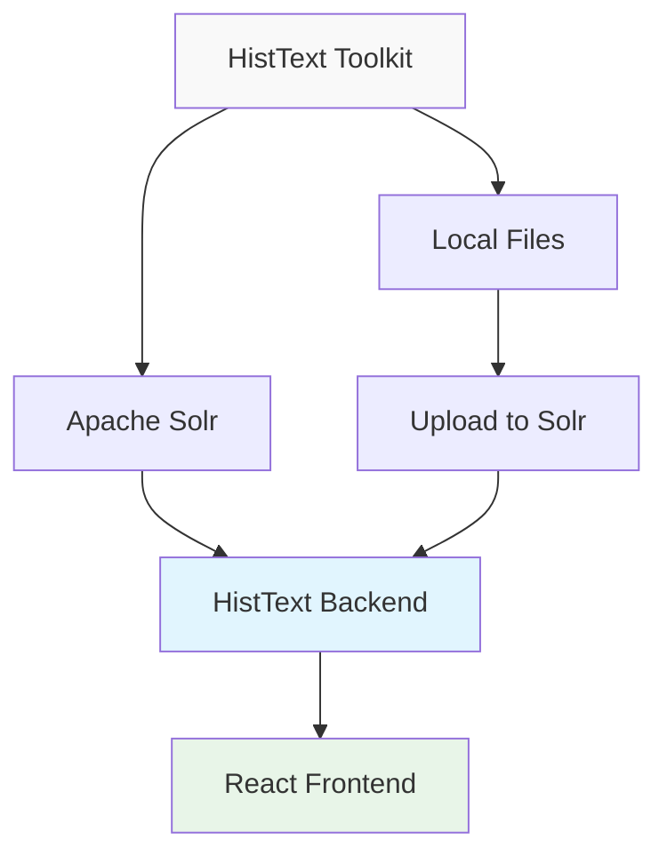
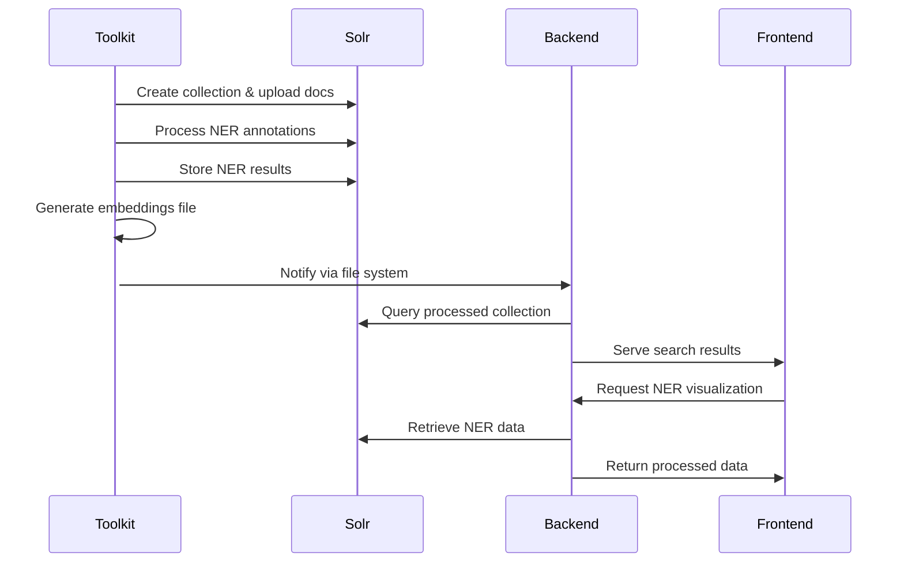

# HistText Toolkit Integration Guide

## Overview

The HistText Toolkit is a separate Python package that integrates with the main HistText application to provide advanced NLP operations. This document explains how both systems work together in production workflows.

## Architecture Integration

### Data Flow


### Shared Components

#### 1. Apache Solr Collections
Both systems use the same Solr instance and collections:
- **Toolkit**: Creates and populates collections with documents
- **Backend**: Queries collections for search and analysis
- **Frontend**: Displays search results and visualizations

#### 2. SSH Tunneling Configuration
- **Toolkit**: Can connect to remote Solr via SSH tunnels
- **Backend**: Uses same SSH configuration from `solr_databases` table
- **Shared**: SSH keys in `data/ssh/` directory

#### 3. Embeddings Data
- **Toolkit**: Generates embeddings files (`.vec`, `.bin` formats)
- **Backend**: Loads embeddings from `EMBED_PATH` configuration
- **Frontend**: Provides word similarity search using backend embeddings

#### 4. NER Annotations
- **Toolkit**: Processes documents and stores NER results in Solr
- **Backend**: Retrieves NER data from Solr for visualization
- **Frontend**: Displays NER results with entity highlighting and analytics

## Production Workflow

### Phase 1: Data Preparation (Toolkit)

#### 1. Document Upload
```bash
# Upload historical documents to Solr collection
histtext-toolkit upload historical_texts documents.jsonl \
  --batch-size 1000 \
  --schema schema.yaml
```

#### 2. NER Processing
```bash
# Process NER annotations with BERT model
histtext-toolkit ner historical_texts \
  --model-name dbmdz/bert-large-cased-finetuned-conll03-english \
  --model-type transformers \
  --text-field content \
  --batch-size 500
```

#### 3. Embeddings Generation
```bash
# Generate word embeddings for semantic search
histtext-toolkit embeddings historical_texts embeddings.vec \
  --model-name sentence-transformers/all-MiniLM-L6-v2 \
  --model-type sentence_transformers \
  --text-field content \
  --output-format vec
```

### Phase 2: Backend Integration

After toolkit processing, the data becomes available to the backend API:

#### 1. Search Operations
```bash
# Backend can now search processed documents
curl "http://localhost:3000/api/solr/query?collection=historical_texts&q=revolution"
```

#### 2. NER Visualization
```bash
# Backend retrieves NER annotations for visualization
curl "http://localhost:3000/api/solr/ner?collection=historical_texts&field=content"
```

#### 3. Word Similarity
```bash
# Backend uses generated embeddings for semantic search
curl -X POST "http://localhost:3000/api/embeddings/neighbors" \
  -H "Content-Type: application/json" \
  -d '{"word": "revolution", "solr_database_id": 1, "collection_name": "historical_texts"}'
```

### Phase 3: Frontend Visualization

Users interact with processed data through the web interface:

#### 1. Search Interface
- Full-text search across processed documents
- Boolean operators and field-specific queries
- Real-time results with highlighting

#### 2. NER Analytics
- 6-tab interface for comprehensive NER analysis
- Entity relationship networks
- Temporal entity tracking
- Statistical dashboards

#### 3. Word Cloud Visualization
- Interactive word frequency visualizations
- Customizable styling and filtering
- Export capabilities

## Configuration Coordination

### Shared Configuration

Both systems should use consistent configuration:

```yaml
# Shared in both toolkit config.yaml and backend .env
solr:
  url: "http://localhost:8983/solr"
  timeout: 30

# Consistent model settings
embeddings:
  model: "sentence-transformers/all-MiniLM-L6-v2"
  dimension: 384
  format: "vec"

ner:
  model: "dbmdz/bert-large-cased-finetuned-conll03-english"
  entity_types: ["PERSON", "LOCATION", "ORGANIZATION", "DATE"]
```

### Backend Configuration (.env)
```bash
# Point to toolkit-generated embeddings
EMBED_PATH=/data/embeddings/historical_texts.vec

# Solr connection (same as toolkit)
SOLR_NER_PORT=8982

# SSH keys (shared with toolkit)
# Keys in data/ssh/ are used by both systems
```

### Toolkit Configuration (config.yaml)
```yaml
# Match backend Solr configuration
solr:
  host: localhost
  port: 8983

# Output paths that backend can access
embeddings:
  output_dir: "/data/embeddings/"
  
cache:
  root_dir: "/data/cache/"
```

## Integration Patterns

### 1. Collection Lifecycle



### 2. Data Consistency

#### Document IDs
- **Toolkit**: Preserves original document IDs from JSONL files
- **Backend**: Uses same IDs for cross-referencing
- **Frontend**: Displays consistent document references

#### Field Naming
- **Toolkit**: Uses configurable field names (`text_field` parameter)
- **Backend**: Expects standard field names (`content`, `title`, `date`)
- **Coordination**: Use consistent field mapping in both systems

#### Entity Types
- **Toolkit**: Configurable entity types per model
- **Backend**: Expects standard entity types for visualization
- **Mapping**: Use consistent entity type labels

### 3. Performance Coordination

#### Caching Strategy
- **Toolkit**: L1/L2/L3 cache for processing operations
- **Backend**: DashMap cache for embeddings, file cache for NER
- **Shared**: Both systems can use same cache directories

#### Resource Management
- **Toolkit**: CPU/GPU intensive during processing
- **Backend**: Memory intensive during serving
- **Coordination**: Stagger intensive operations to avoid resource conflicts

## Monitoring & Maintenance

### Health Checks

#### Toolkit Health
```bash
# Check toolkit installation
histtext-toolkit --version

# Test model availability
histtext-toolkit list-models

# Verify Solr connectivity
histtext-toolkit verify-solr historical_texts
```

#### Integration Health
```bash
# Check if backend can access toolkit outputs
curl "http://localhost:3000/api/embeddings/neighbors" \
  -H "Content-Type: application/json" \
  -d '{"word": "test", "solr_database_id": 1, "collection_name": "historical_texts"}'

# Verify NER data accessibility
curl "http://localhost:3000/api/solr/ner?collection=historical_texts"
```

### Troubleshooting Integration Issues

#### Issue: Backend can't find embeddings
```bash
# Check file paths
ls -la /data/embeddings/
grep EMBED_PATH app/.env

# Verify file format
file /data/embeddings/historical_texts.vec
head -n 5 /data/embeddings/historical_texts.vec
```

#### Issue: NER data not appearing in frontend
```bash
# Check Solr field mapping
curl "http://localhost:8983/solr/historical_texts/select?q=*:*&rows=1&fl=*"

# Verify NER field names
curl "http://localhost:3000/api/solr/ner?collection=historical_texts&limit=1"
```

#### Issue: Search results inconsistent
```bash
# Compare document counts
# Toolkit view:
curl "http://localhost:8983/solr/historical_texts/select?q=*:*&rows=0"

# Backend view:
curl "http://localhost:3000/api/solr/query?collection=historical_texts&q=*:*&rows=0"
```

## Best Practices

### 1. Development Workflow
1. **Development**: Use toolkit for data preparation and testing
2. **Staging**: Validate integration between toolkit and backend
3. **Production**: Deploy both systems with shared configuration

### 2. Data Management
- **Version Control**: Tag toolkit outputs with version numbers
- **Backup Strategy**: Backup both Solr data and generated embeddings
- **Rollback Plan**: Keep previous versions for quick rollback

### 3. Performance Optimization
- **Batch Processing**: Use toolkit for batch operations, backend for real-time
- **Resource Scheduling**: Run toolkit processing during off-peak hours
- **Cache Warming**: Pre-populate backend caches after toolkit processing

### 4. Security Considerations
- **Shared SSH Keys**: Secure key management for both systems
- **Access Control**: Same user permissions for both toolkit and backend
- **Data Privacy**: Consistent data handling policies across both systems

## Migration Guide

### From Standalone to Integrated Setup

#### 1. Assess Current Data
```bash
# Check existing collections
curl "http://localhost:8983/solr/admin/collections?action=LIST"

# Verify data quality
histtext-toolkit examine-jsonl cache/processed/*.jsonl
```

#### 2. Align Configurations
```bash
# Backup current configs
cp app/.env app/.env.backup
cp toolkit/config.yaml toolkit/config.yaml.backup

# Create shared configuration template
# Use consistent field names and paths
```

#### 3. Test Integration
```bash
# Process test collection with toolkit
histtext-toolkit upload test_collection test_data.jsonl

# Verify backend can access data
curl "http://localhost:3000/api/solr/query?collection=test_collection&q=*:*"

# Check frontend visualization
# Access http://localhost:3000 and test search
```

This integration guide ensures smooth coordination between the HistText Toolkit and main application, enabling powerful text analysis workflows while maintaining system separation and modularity.