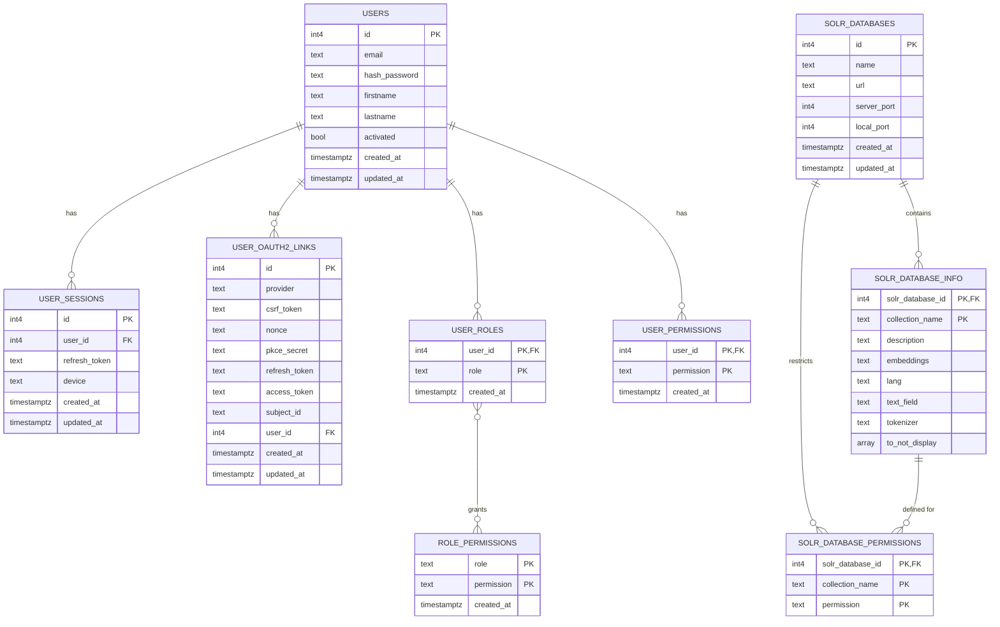

# Database Schema Documentation

This document describes the database schema used in the project. The schema is built using the Diesel ORM for Rust with PostgreSQL.

## Table of Contents
- [Overview](#overview)
- [User Management](#user-management)
  - [Users](#users)
  - [User Sessions](#user-sessions)
  - [OAuth2 Links](#oauth2-links)
- [Authorization System](#authorization-system)
  - [User Roles](#user-roles)
  - [Role Permissions](#role-permissions)
  - [User Permissions](#user-permissions)
- [Solr Search Integration](#solr-search-integration)
  - [Solr Databases](#solr-databases)
  - [Solr Database Info](#solr-database-info)
  - [Solr Database Permissions](#solr-database-permissions)
- [Relationships](#relationships)
- [Visual Schema](#visual-schema)

## Overview

The schema consists of several interconnected tables that handle user authentication, authorization through roles and permissions, session management, and Solr search database configurations.

## User Management

### Users

The `users` table stores user account information.

| Column | Type | Description |
|--------|------|-------------|
| id | Int4 | Primary key |
| email | Text | User's email address |
| hash_password | Text | Hashed password for authentication |
| firstname | Text | User's first name |
| lastname | Text | User's last name |
| activated | Bool | Whether the account is activated |
| created_at | Timestamptz | Account creation timestamp |
| updated_at | Timestamptz | Last update timestamp |

### User Sessions

The `user_sessions` table tracks active user sessions.

| Column | Type | Description |
|--------|------|-------------|
| id | Int4 | Primary key |
| user_id | Int4 | Foreign key to users table |
| refresh_token | Text | Token used to refresh authentication |
| device | Nullable\<Text\> | Optional device information |
| created_at | Timestamptz | Session creation timestamp |
| updated_at | Timestamptz | Last session update timestamp |

### OAuth2 Links

The `user_oauth2_links` table manages OAuth2 authentication connections.

| Column | Type | Description |
|--------|------|-------------|
| id | Int4 | Primary key |
| provider | Text | OAuth provider (e.g., Google, GitHub) |
| csrf_token | Text | Cross-Site Request Forgery protection token |
| nonce | Text | Number used once for security |
| pkce_secret | Text | Proof Key for Code Exchange secret |
| refresh_token | Nullable\<Text\> | OAuth refresh token |
| access_token | Nullable\<Text\> | OAuth access token |
| subject_id | Nullable\<Text\> | Provider's unique identifier for the user |
| user_id | Nullable\<Int4\> | Foreign key to users table |
| created_at | Timestamptz | Record creation timestamp |
| updated_at | Timestamptz | Last update timestamp |

## Authorization System

The project implements a sophisticated authorization system with roles and permissions.

### User Roles

The `user_roles` table associates users with roles in a many-to-many relationship.

| Column | Type | Description |
|--------|------|-------------|
| user_id | Int4 | Primary key part 1, Foreign key to users table |
| role | Text | Primary key part 2, Role identifier |
| created_at | Timestamptz | Record creation timestamp |

### Role Permissions

The `role_permissions` table defines what permissions are associated with each role.

| Column | Type | Description |
|--------|------|-------------|
| role | Text | Primary key part 1, Role identifier |
| permission | Text | Primary key part 2, Permission identifier |
| created_at | Timestamptz | Record creation timestamp |

### User Permissions

The `user_permissions` table assigns direct permissions to users, bypassing roles.

| Column | Type | Description |
|--------|------|-------------|
| user_id | Int4 | Primary key part 1, Foreign key to users table |
| permission | Text | Primary key part 2, Permission identifier |
| created_at | Timestamptz | Record creation timestamp |

## Solr Search Integration

The application integrates with Solr for search functionality.

### Solr Databases

The `solr_databases` table stores Solr server configurations.

| Column | Type | Description |
|--------|------|-------------|
| id | Int4 | Primary key |
| name | Text | Name of the Solr database |
| url | Text | URL of the Solr server |
| server_port | Int4 | Port on which the Solr server runs |
| local_port | Int4 | Local port used for connections |
| created_at | Timestamptz | Record creation timestamp |
| updated_at | Timestamptz | Last update timestamp |

### Solr Database Info

The `solr_database_info` table stores metadata about Solr collections.

| Column | Type | Description |
|--------|------|-------------|
| solr_database_id | Int4 | Primary key part 1, Foreign key to solr_databases |
| collection_name | Text | Primary key part 2, Name of the Solr collection |
| description | Text | Description of the collection |
| embeddings | Text | Embedding configuration |
| lang | Nullable\<Text\> | Optional language specification |
| text_field | Nullable\<Text\> | Optional primary text field |
| tokenizer | Nullable\<Text\> | Optional tokenizer configuration |
| to_not_display | Nullable\<Array\<Nullable\<Text\>\>\> | Fields to exclude from display |

### Solr Database Permissions

The `solr_database_permissions` table manages access to Solr collections.

| Column | Type | Description |
|--------|------|-------------|
| solr_database_id | Int4 | Primary key part 1, Foreign key to solr_databases |
| collection_name | Text | Primary key part 2, Collection name |
| permission | Text | Primary key part 3, Permission identifier |

## Relationships

The schema includes the following relationships:

- `user_sessions` → `users`: A user can have multiple sessions
- `user_oauth2_links` → `users`: A user can have multiple OAuth connections
- `user_permissions` → `users`: A user can have multiple direct permissions
- `user_roles` → `users`: A user can have multiple roles
- `solr_database_info` → `solr_databases`: A Solr database can have multiple collections
- `solr_database_permissions` → `solr_databases`: A Solr database collection can have multiple permission entries

The authorization system follows a comprehensive approach:
1. Users can be assigned roles through `user_roles`
2. Roles are given permissions through `role_permissions`
3. Users can also be given direct permissions through `user_permissions`

This flexible design allows for both role-based and permission-based access control.

## Visual Schema

> **Note**: To view the interactive diagram, you can:
> 1. Use GitHub's support for Mermaid (now available in GitHub Markdown)
> 2. Copy the Mermaid code below into an online Mermaid editor like [Mermaid Live Editor](https://mermaid.live/)
> 3. Or use a VS Code extension that supports Mermaid

### Schema Overview (Text Description)

1. **User Management**
   - Each user can have multiple sessions
   - Each user can have multiple OAuth2 connections
   - Each user can have multiple roles
   - Each user can have multiple direct permissions

2. **Role-based Authorization**
   - Many-to-many relationship between users and roles
   - Many-to-many relationship between roles and permissions
   - Users can be granted permissions directly

3. **Solr Search Configuration**
   - Each Solr database can have multiple collections (via solr_database_info)
   - Each collection can have multiple permission entries
   - Permissions control access to specific collections

The notation in the diagram follows standard ER diagram conventions:
- `||--o{` represents a one-to-many relationship
- `}o--o{` represents a many-to-many relationship
- `PK` indicates a primary key
- `FK` indicates a foreign key