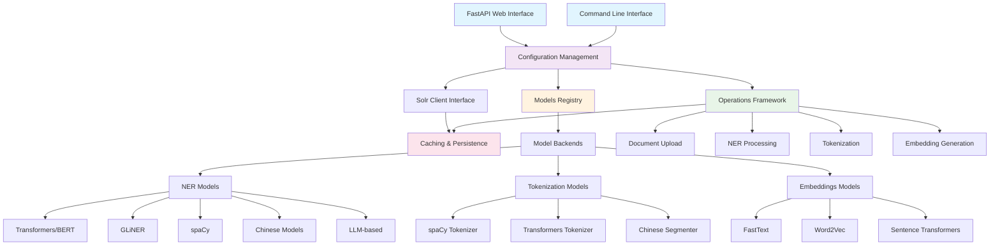

# HistText Toolkit

A comprehensive Python toolkit for advanced Natural Language Processing operations on historical text collections stored in Apache Solr. The toolkit provides both CLI and modern web interfaces for text processing, named entity recognition, embeddings generation, and document upload operations.

## Features

### **Dual Interface**
- **Command Line Interface (CLI)**: Traditional CLI for scripting and automation
- **Modern Web UI**: FastAPI-based web interface with interactive documentation

### **Text Processing**
- **Multi-language tokenization** with specialized Chinese text segmentation
- **15+ NER model types** including Transformers, GLiNER, spaCy, Flair, and specialized Chinese models
- **Word embeddings generation** with Word2Vec, FastText, and Sentence Transformers
- **Batch processing** with checkpoint support for large collections

### **Collection Management**
- **JSONL document upload** to Solr collections with automatic schema detection
- **Embeddings computation** for entire document collections
- **NER processing** with configurable entity types and confidence thresholds
- **Configuration management** with YAML-based settings

### **Model Support**

#### NER Models
- **Transformers**: BERT, RoBERTa, DistilBERT, multilingual models
- **GLiNER**: Zero-shot NER with custom entity types
- **spaCy**: Pre-trained models for multiple languages
- **Flair**: Contextual string embeddings
- **Stanza**: Stanford NLP toolkit with Chinese support
- **Chinese-specific**: LAC, HanLP, PKUSEG, FastHan, FastNLP
- **LLM-based**: Llama, Mistral, Qwen for advanced NER

#### Tokenization Models
- **spaCy**: Industrial-strength tokenization
- **Transformers**: Subword tokenization (BPE, WordPiece)
- **Chinese Segmenter**: Jieba-based Chinese text segmentation

#### Embeddings Models
- **FastText**: Pre-trained and trainable models
- **Word2Vec**: Classic word embeddings
- **Sentence Transformers**: Semantic embeddings for documents

---

## Table of Contents

1. [Prerequisites](#prerequisites)  
2. [Installation](#installation)  
3. [Configuration](#configuration)  
4. [Usage](#usage)  
   - [Global Options](#global-options)  
   - [Commands Overview](#commands-overview)
   - [Document Management](#document-management)
   - [Text Processing](#text-processing)
   - [Named Entity Recognition](#named-entity-recognition)
   - [Embedding Operations](#embedding-operations)
   - [Utility Commands](#utility-commands)
5. [Embedding Features](#embedding-features)
   - [Document Embeddings](#document-embeddings)
   - [Semantic Search](#semantic-search)
   - [Word Embeddings](#word-embeddings)
   - [Supported Formats](#supported-formats)
   - [Performance Considerations](#performance-considerations)
6. [Caching & Directory Structure](#caching--directory-structure)  
7. [Error Handling & Recovery](#error-handling--recovery)
8. [Architecture Overview](#architecture-overview)
9. [Advanced Configuration](#advanced-configuration)
10. [Contributing](#contributing)
11. [License](#license)

---

## Prerequisites

- **Python** 3.10+
- **Java** 8+ (for Apache Solr)
- **Apache Solr** instance (v8.0+ recommended) 
- **GPU** (optional, recommended for transformer models and large collections)
- **Memory** requirements vary by model:
  - Basic operations: 4GB+ RAM
  - NER with transformers: 8GB+ RAM
  - Word embeddings training: 4GB+ RAM recommended for large collections
  - GPU memory: 4GB+ for transformer models (8GB+ recommended)

---

## Installation

### Basic Installation

```bash
git clone https://github.com/BaptisteBlouin/HistText.git
cd HistText/toolkit
pip install .
```

### Install with Specific Features

The toolkit uses optional dependencies to keep the base installation lightweight. Install only what you need:

```bash
# spaCy support for NER and tokenization
pip install .[spacy]

# Hugging Face Transformers (includes PyTorch)
pip install .[transformers]

# GLiNER for specialized historical entity recognition
pip install .[gliner]

# Chinese text processing
pip install .[chinese]
pip install git+https://github.com/hhhuang/ChineseWordSegmenter.git

# Document embeddings and semantic search
pip install .[embeddings]

# Word embeddings generation
pip install .[word_embeddings]

# All features (includes all dependencies)
pip install .[all]
```

### Dependencies

**Core dependencies** (installed automatically):

* `aiohttp>=3.8.0` - Asynchronous HTTP client/server
* `jsonlines>=2.0.0` - JSON lines file format handling
* `pyyaml>=6.0` - YAML configuration parsing
* `tqdm>=4.62.0` - Progress bar for long-running operations
* `numpy>=1.20.0` - Numerical operations for embeddings

**Optional dependencies** by feature:

* **spacy**: NER and tokenization models
* **transformers**: State-of-the-art models from HuggingFace
* **gliner**: Historical entity recognition
* **chinese**: Chinese text segmentation and conversion
* **embeddings**: Document-level embeddings and semantic search
* **word_embeddings**: Custom word vector training

### Development Installation

For development, install in editable mode with development extras:

```bash
pip install -e .[all,dev]
```

---

## Configuration

The toolkit uses YAML configuration files to manage settings for Solr connections, caching, and models.

### Configuration File

By default, the toolkit looks for a `config.yaml` in the working directory. You can specify a different file with the `--config` option.

### Example Configuration

```yaml
# Solr connection settings
solr:
  host: localhost          # Solr host
  port: 8983               # Solr port
  username: solr_user      # optional
  password: solr_pass      # optional
  timeout: 30              # Connection timeout in seconds (optional)

# Cache settings
cache:
  root_dir: ./cache        # Directory for caching
  enabled: true            # Enable/disable caching
  max_size_gb: 10          # Maximum cache size in GB (optional)

# Logging settings (optional)
logging:
  level: INFO              # Default log level
  file: logs/histtext.log  # Log file path (optional)
  
# Model definitions
models:
  # Transformer model for NER and tokenization
  bert-base:
    path: bert-base-uncased
    type: transformers
    max_length: 512
    aggregation_strategy: FIRST
    
  # spaCy model
  spacy-en:
    path: en_core_web_sm
    type: spacy
    
  # Chinese segmentation model
  zh-segmenter:
    path: chinese_segmenter
    type: chinese_segmenter
    
  # Word2Vec model for embeddings
  word2vec-model:
    path: /path/to/word2vec/model.bin
    type: word2vec
    binary: true
    dim: 300
    
  # FastText model
  fasttext-en:
    path: cc.en.300.bin
    type: fasttext
    dim: 300
    
  # Sentence Transformer model
  sentence-transformer:
    path: all-MiniLM-L6-v2
    type: sentence_transformers
    max_length: 256
    
  # GLiNER model for historical entities
  gliner-hist:
    path: /path/to/gliner/model
    type: gliner
```

### Configuration Hierarchy

Settings are applied in the following order of precedence:

1. Command-line arguments (highest priority)
2. Environment variables (prefixed with `HISTTEXT_`)
3. Configuration file
4. Default values (lowest priority)

### Environment Variables

All configuration options can also be set via environment variables:

```bash
# Set Solr connection
export HISTTEXT_SOLR_HOST=localhost
export HISTTEXT_SOLR_PORT=8983

# Set cache directory
export HISTTEXT_CACHE_DIR=./my_cache
```

---

## Usage

### CLI Usage

Invoke the toolkit via the console script or directly as a module:

```bash
# Using the new Click-based CLI (recommended)
histtext-toolkit [GLOBAL OPTIONS] <command> [COMMAND OPTIONS]

# Or with Python's module flag
python -m histtext_toolkit.cli [GLOBAL OPTIONS] <command> [COMMAND OPTIONS]
```

### Web Interface

Start the modern FastAPI web interface:

```bash
# Start web UI server
cd histtext_fastapi/
uvicorn app.main:app --host 0.0.0.0 --port 8000 --reload
```

Access the web interface:
- **Main Interface**: http://localhost:8000
- **API Documentation**: http://localhost:8000/docs
- **Alternative Docs**: http://localhost:8000/redoc

#### Web UI Features
- **Interactive forms** for all operations
- **Real-time progress tracking** for long-running tasks
- **Model configuration** with parameter validation
- **Results visualization** and download
- **API endpoint testing** with automatic documentation

### Global Options

Global options must be specified **before** the subcommand:

* `-c, --config <file>` – Path to YAML configuration file
* `-l, --log-level <LEVEL>` – Set logging level (`DEBUG`, `INFO`, `WARNING`, `ERROR`, `CRITICAL`)
* `--solr-host <host>` – Solr hostname (default: `localhost`)
* `--solr-port <port>` – Solr port (default: `8983`)
* `--solr-user <username>` - Solr username for authentication (optional)
* `--solr-pass <password>` - Solr password for authentication (optional)
* `--cache-dir <dir>` – Cache directory (default: `./cache`)
* `--cache-disabled` – Disable caching (overrides config)
* `--verbose` – Enable verbose output with more detailed progress information

### Commands Overview

The toolkit provides commands in several categories:

#### Configuration Management

* `config create` - Create default configuration file
* `config show` - Show current configuration
* `config validate` - Validate configuration file

#### Document Management

* `upload` - Upload JSONL files to a Solr collection
* `upload-ner` - Upload precomputed NER annotations to Solr
* `examine-jsonl` - Examine the content of JSONL files

#### Text Processing

* `tokenize` - Tokenize text from various sources
* `tokenize-csv` - Tokenize text in a CSV file
* `tokenize-text` - Tokenize a text string
* `tokenize-solr` - Tokenize documents from a Solr collection

#### Named Entity Recognition

* `ner` - Run NER on collections with multiple model support
* `precompute-ner` - Precompute NER annotations for a collection
* `test-ner` - Test NER models with sample text

#### Embedding Operations

* `embeddings` - Compute document embeddings for a collection
* `semantic-search` - Search documents using semantic similarity
* `compute-word-embeddings` - Generate word embeddings from collection texts
* `build-embedding-index` - Build a vector index for a collection

#### Utility Commands

* `list-models` - List available model types and tasks
* `verify-solr` - Check Solr connection and collection status
* `clear-cache` - Clear the cache directory
* `server` - Start FastAPI web server (alternative to uvicorn)

### Example Command Structure

```bash
python -m histtext_toolkit.cli \
  --solr-host localhost --solr-port 8983 \
  upload test-collection ./data/*.jsonl --schema ./schemas/test.yaml
```

### Document Management

#### Upload Documents

Upload JSONL files to a Solr collection:

```bash
python -m histtext_toolkit.cli upload my-collection ./data/*.jsonl --schema schema.yaml --batch-size 500
```

**Options:**
* `collection` - Name of the target collection
* `jsonl_files` - JSONL files to upload (glob patterns supported)
* `--schema` - Path to schema file (optional)
* `-b, --batch-size` - Number of documents per batch (default: 1000)

#### Upload Precomputed NER

Upload precomputed NER annotations to a Solr collection:

```bash
python -m histtext_toolkit.cli upload-ner target-collection model-name source-collection text-field
```

**Options:**
* `collection` - Name of the target collection
* `model_name` - Name of the model used for NER
* `solr_collection` - Name of the source collection
* `field` - Field name containing text
* `-b, --batch-size` - Documents per batch (default: 1000)

#### Examine JSONL Files

Inspect the content of JSONL files:

```bash
python -m histtext_toolkit.cli examine-jsonl ./cache/model/collection/field/*.jsonl -n 3
```

**Options:**
* `files` - JSONL files to examine
* `-n, --num-docs` - Number of documents to show (default: 1)

### Text Processing

#### Tokenize CSV

Tokenize text in a CSV file:

```bash
python -m histtext_toolkit.cli tokenize-csv bert-base input.csv output.csv --text-column "Text"
```

**Options:**
* `model_name` - Name of the model to use
* `input_file` - Input CSV file
* `output_file` - Output CSV file
* `--text-column` - Column containing text (default: "Text")
* `--simplify-chinese` - Convert traditional Chinese to simplified

#### Tokenize Text

Tokenize a text string:

```bash
python -m histtext_toolkit.cli tokenize-text bert-base "This is a sample text to tokenize."
```

**Options:**
* `model_name` - Name of the model to use
* `text` - Text to tokenize
* `--simplify-chinese` - Convert traditional Chinese to simplified

#### Tokenize Solr Collection

Tokenize documents from a Solr collection and cache the results:

```bash
python -m histtext_toolkit.cli tokenize-solr my-collection --model-name bert-base --text-field text
```

**Options:**
* `collection` - Name of the source collection
* `--model-name` - Name of the model to use
* `--text-field` - Field containing text (default: "text")
* `--model-type` - Type of model (default: "transformers")
* `--start` - Start index (default: 0)
* `-b, --batch-size` - Number of documents per batch (default: 1000)
* `-n, --num-batches` - Maximum number of batches to process
* `-f, --filter-query` - Filter query
* `--simplify-chinese` - Convert traditional Chinese to simplified

### Named Entity Recognition

#### Precompute NER

Precompute NER annotations for a collection:

```bash
python -m histtext_toolkit.cli precompute-ner my-collection --model-name spacy-en --text-field text
```

**Options:**
* `collection` - Name of the collection
* `--model-name` - Name of the model to use
* `--text-field` - Field containing text (default: "text")
* `--model-type` - Type of model (default: "transformers")
* `--aggregation-strategy` - Strategy for aggregating tokens (default: "FIRST")
* `--start` - Start index (default: 0)
* `-b, --batch-size` - Number of documents per batch (default: 10000)
* `-n, --num-batches` - Maximum number of batches to process
* `-f, --filter-query` - Filter query
* `-s, --shorten` - Use shortened field names
* `--format` - Format type (default: "flat")

### Embedding Operations

See the [Embedding Features](#embedding-features) section for detailed information.

#### Compute Document Embeddings

```bash
python -m histtext_toolkit.cli compute-embeddings my-collection output/embeddings \
  --model-name all-MiniLM-L6-v2 --model-type sentence_transformers \
  --text-field content --output-format binary
```

#### Perform Semantic Search

```bash
python -m histtext_toolkit.cli semantic-search research-papers "climate change mitigation strategies" \
  --model-name all-mpnet-base-v2 --model-type sentence_transformers \
  --text-field abstract --top-k 15
```

#### Generate Word Embeddings

```bash
python -m histtext_toolkit.cli compute-word-embeddings historical-texts embeddings/word-vectors \
  --text-field full_text --method word2vec --dim 200 --window 10
```

#### Build Embedding Index

```bash
python -m histtext_toolkit.cli build-embedding-index my-collection embeddings-index \
  --model-name sentence-transformer --text-field content
```

### Utility Commands

#### List Available Models

```bash
python -m histtext_toolkit.cli list-models
```

#### Verify Solr Connection

```bash
python -m histtext_toolkit.cli verify-solr my-collection
```

#### Clear Cache

```bash
python -m histtext_toolkit.cli clear-cache --model bert-base --collection my-collection
```

## API Reference

### REST Endpoints

The FastAPI web interface provides RESTful endpoints:

#### Configuration
- `GET /api/config` - Get current configuration
- `POST /api/config` - Update configuration
- `GET /api/models` - List available models

#### Upload Operations
- `POST /api/upload/solr` - Upload JSONL files to Solr
- `GET /api/upload/status/{task_id}` - Check upload progress

#### NER Operations  
- `POST /api/ner/process` - Run NER on collection
- `GET /api/ner/status/{task_id}` - Check NER progress
- `GET /api/ner/results/{task_id}` - Get NER results

#### Tokenization
- `POST /api/tokenize/collection` - Tokenize Solr collection
- `POST /api/tokenize/text` - Tokenize text directly

#### Embeddings
- `POST /api/embeddings/compute` - Generate embeddings for collection
- `POST /api/embeddings/similarity` - Compute word similarity

### Python API

Use the toolkit programmatically:

```python
from histtext_toolkit.core.config import ModelConfig
from histtext_toolkit.models.registry import create_ner_model
from histtext_toolkit.operations.ner import process_ner
from histtext_toolkit.solr.client import SolrClient

# Create NER model
config = ModelConfig(
    name="dbmdz/bert-large-cased-finetuned-conll03-english",
    type="transformers",
    path="dbmdz/bert-large-cased-finetuned-conll03-english"
)
model = create_ner_model(config)

# Initialize Solr client
solr_client = SolrClient("http://localhost:8983/solr")

# Process collection
await process_ner(
    solr_client=solr_client,
    collection="my_collection",
    text_field="content",
    model_config=config,
    output_path="ner_results.json"
)
```

---

## Embedding Features

The HistText Toolkit provides comprehensive support for working with embeddings at both the document and word level.

### Document Embeddings

Document embeddings represent entire texts as dense vectors, enabling semantic search and document similarity analysis. The toolkit supports multiple embedding models:

#### Supported Models

1. **FastText** - Efficient word embeddings with subword information
   ```bash
   python -m histtext_toolkit.cli compute-embeddings collection output/embeddings \
     --model-name cc.en.300.bin --model-type fasttext --text-field text
   ```

2. **Word2Vec** - Classic word embeddings model (via Gensim)
   ```bash
   python -m histtext_toolkit.cli compute-embeddings collection output/embeddings \
     --model-name word2vec-google-news-300 --model-type word2vec --text-field text
   ```

3. **Sentence Transformers** - State-of-the-art semantic representations
   ```bash
   python -m histtext_toolkit.cli compute-embeddings collection output/embeddings \
     --model-name all-MiniLM-L6-v2 --model-type sentence_transformers --text-field text
   ```

#### Key Options

- `--output-format` - Format to save embeddings (vec, txt, binary, json)
- `--batch-size` - Number of documents per batch
- `--filter-query` - Solr filter query to select specific documents
- `--start` - Starting document index
- `--num-batches` - Maximum number of batches to process
- `--simplify-chinese` - Convert traditional Chinese to simplified

### Semantic Search

Perform semantic search within a collection using embeddings:

```bash
python -m histtext_toolkit.cli semantic-search collection "query text" \
  --model-name all-mpnet-base-v2 --model-type sentence_transformers \
  --text-field abstract --top-k 10
```

This computes the embedding for the query text and finds the most similar documents in the collection based on cosine similarity.

#### Key Options

- `--model-name` - Name of the model to use
- `--model-type` - Type of model (fasttext, word2vec, sentence_transformers)
- `--text-field` - Field containing text to compare
- `--top-k` - Number of top results to return (default: 10)
- `--filter-query` - Solr filter query to restrict search scope

### Word Embeddings

The toolkit can generate custom word embeddings directly from your text collections:

```bash
python -m histtext_toolkit.cli compute-word-embeddings collection output/word-vectors \
  --text-field content --method word2vec --dim 200 --window 8 \
  --min-count 5 --output-format txt
```

#### Word Embedding Methods

1. **Word2Vec** - Classic word embedding algorithm (via Gensim)
   - Fast training, good for general purposes
   - Options for window size and dimensionality

2. **FastText** - Enhanced word embeddings with subword information
   - Better handling of out-of-vocabulary words
   - Good for morphologically rich languages

#### Key Options

- `--method` - Word embedding method (word2vec, fasttext)
- `--dim` - Dimension of word embeddings (default: 100)
- `--window` - Context window size (default: 5)
- `--min-count` - Minimum word count (default: 5)
- `--workers` - Number of worker threads (default: 4)
- `--output-format` - Format to save word vectors (txt, vec, bin, gensim)

### Supported Formats

The toolkit supports multiple formats for saving embeddings:

1. **txt / vec** - Text format compatible with Word2Vec and FastText
   - First line: `<vocab_size> <dimension>`
   - Subsequent lines: `<word> <v1> <v2> ... <vn>`

2. **bin** - Binary format for faster loading
   - More compact storage
   - Faster to load but not human-readable

3. **gensim** - Gensim's native format (for word embeddings only)
   - Preserves more model information
   - Only loadable with Gensim

4. **json** - JSON format for compatibility
   - Human-readable and easily parsed
   - Includes metadata

### Performance Considerations

When working with embeddings, consider these performance factors:

- **Memory Usage**: Embedding operations can be memory-intensive, especially for large collections
- **GPU Acceleration**: Transformer-based models benefit significantly from GPU acceleration
- **Batch Size**: Adjust batch size based on available memory and model complexity
- **Checkpointing**: Long-running operations automatically create checkpoints for recovery
- **Caching**: Intermediate results are cached to prevent redundant computation

For large collections, consider:
- Using a higher `--batch-size` for more efficient processing
- Enabling checkpointing to resume interrupted operations
- Using filter queries to process subsets of the collection in stages

---

## Caching & Directory Structure

The toolkit implements a comprehensive caching system to improve performance and enable incremental processing.

### Cache Structure

By default, all intermediate outputs are stored under the configured cache directory:

```
cache/
├── <model_name>/               # E.g., bert-base-chinese, gliner-model
│   └── <collection>/           # Solr collection name
│       └── <field>/            # Field name (e.g., text, content)
│           ├── 0.jsonl         # Batch starting at document 0
│           ├── 1000.jsonl      # Batch starting at document 1000
│           └── ...
├── <model_name_2>/
│   └── ...
└── embeddings/                 # Document and word embeddings
    ├── document/
    │   └── <collection>/
    │       ├── embeddings.vec
    │       └── embeddings.bin
    └── word/
        └── <collection>/
            ├── word_vectors.txt
            └── word_vectors.bin
```

Each cached file contains processed data such as tokenized text, NER annotations, or embeddings.

### Cache Management

The toolkit automatically manages the cache:

- **Creation**: Directories are created as needed
- **Reuse**: Cached results are reused when available
- **Invalidation**: Cache can be cleared with the `clear-cache` command
- **Checkpointing**: Partial results are saved during long operations

### Cache Configuration

Configure caching behavior in `config.yaml`:

```yaml
cache:
  root_dir: ./cache        # Base cache directory
  enabled: true            # Enable/disable caching
  max_size_gb: 10          # Maximum cache size (optional)
  ttl_days: 30             # Time-to-live in days (optional)
```

Or via command-line options:

```bash
python -m histtext_toolkit.cli --cache-dir ./my_cache upload collection data.jsonl
python -m histtext_toolkit.cli --cache-disabled tokenize-solr collection
```

### Checkpoint System

For long-running operations, the toolkit creates checkpoints that allow:

- Resuming interrupted operations
- Recovering from errors
- Incrementally processing large collections

Checkpoint files are stored alongside the cached output with `.checkpoint.json` extension and contain progress information.

### File Formats

The toolkit uses these primary file formats:

- **JSONL** (.jsonl) - JSON Lines for document data
- **YAML** (.yaml) - Configuration and schema files
- **Vector formats** (.vec, .txt, .bin) - Embedding vectors
- **CSV** (.csv) - Structured tabular data

---

## Error Handling & Recovery

The HistText Toolkit implements error handling and recovery mechanisms to ensure reliability when processing large collections.

### Error Handling Features

- **Structured exceptions** with detailed error information
- **Automatic retries** for transient failures (network issues, timeouts)
- **Graceful degradation** when resources are constrained
- **Checkpoint system** for resuming interrupted operations
- **Signal handling** for graceful termination (e.g., CTRL+C)
- **Memory management** to prevent out-of-memory errors
- **Detailed logging** with context-specific information

### Error Recovery Strategies

The toolkit employs multiple strategies for error recovery:

1. **Exponential backoff** for Solr connection issues
2. **Batch size adaptation** based on failure patterns
3. **Partial result preservation** to avoid losing completed work
4. **Memory monitoring** with automatic resource adjustment
5. **Progress tracking** for transparent operation status

### Checkpoint System

For long-running operations like embedding generation and NER, the toolkit creates checkpoints:

- **Automatic saving** at regular intervals (e.g., every 5 batches)
- **Resumption capability** from the last completed batch
- **Document tracking** to avoid reprocessing
- **Metadata preservation** for consistent results

To resume an interrupted operation, simply run the same command again, and the toolkit will continue from the last checkpoint.

---

## Architecture Overview

### System Architecture

The HistText Toolkit follows a modular architecture for flexibility and extensibility:



### Core Modules

1. **CLI Entry Point**
   * `histtext_toolkit/main.py` — Argument parsing, config loading, command dispatch
   * `histtext_toolkit/cli.py` — Console script entry point

2. **Core Framework**
   * `core/config.py` — Configuration management
   * `core/logging.py` — Logging infrastructure
   * `core/errors.py` — Error handling system

3. **Operations**
   * `operations/ner.py` — NER processing
   * `operations/tokenize.py` — Tokenization operations
   * `operations/upload.py` — Solr document operations
   * `operations/embeddings.py` — Embedding and semantic search

4. **Model Abstractions**
   * `models/base.py` — Base classes for models
   * `models/registry.py` — Model discovery and instantiation

5. **Model Implementations**
   * `models/spacy_model.py` — spaCy integration
   * `models/transformers_model.py` — HuggingFace integration
   * `models/gliner_model.py` — GLiNER integration
   * `models/chinese_segmenter.py` — Chinese segmentation
   * `models/fasttext_model.py` — FastText/Word2Vec embeddings
   * `models/word_embeddings_model.py` — Word vector training

6. **Solr Integration**
   * `solr/client.py` — Communication with Solr
   * `solr/schema.py` — Schema management

7. **Caching System**
   * `cache/manager.py` — Cache organization and retrieval

### Model Registry

The model registry enables the toolkit to work with different model types using a consistent interface. The abstract base classes ensure that all model implementations support the required operations:

* **`NERModel`** — Named entity recognition
* **`TokenizationModel`** — Text tokenization
* **`EmbeddingsModel`** — Vector representations

When a command is executed, the registry selects the appropriate model implementation based on the configuration.

### Asynchronous Processing

The toolkit uses asynchronous I/O (via `asyncio` and `aiohttp`) for efficient communication with Solr, allowing:

* Non-blocking operations
* Concurrent requests
* Timeout management
* Connection pooling

### Pipeline Architecture

Operations are organized as pipelines, where each stage processes data and passes it to the next:

1. **Data Retrieval** — Fetch from Solr or load from files
2. **Preprocessing** — Normalize and prepare text
3. **Model Processing** — Apply NLP models
4. **Postprocessing** — Format and structure results
5. **Storage** — Cache or upload to Solr

This pipeline architecture enables efficient processing of large document collections.

---

## Performance & Optimization

### Adaptive Batch Sizing

The toolkit automatically adjusts batch sizes based on actual implementation:

- **Text length**: 4-64 documents per batch depending on average text length
- **Available memory**: Scales with GPU/RAM availability detected at runtime
- **Error rate**: Reduces batch size if >20% error rate occurs
- **Success rate**: Increases batch size if <1% error rate maintained

### Memory Requirements by Model Type

Based on actual implementation:

| Model Type | Min RAM | Recommended RAM | GPU Memory | Notes |
|------------|---------|-----------------|------------|--------|
| spaCy | 1GB | 2GB | N/A | CPU-only processing |
| Transformers (base) | 2GB | 4GB | 2GB | BERT, RoBERTa models |
| Transformers (large) | 4GB | 8GB | 4GB | Large BERT models |
| GLiNER | 2GB | 4GB | 2GB | Zero-shot NER |
| Chinese models | 1GB | 2GB | N/A | LAC, HanLP, PKUSEG |
| LLM-based | 8GB+ | 16GB+ | 8GB+ | Llama, Mistral, Qwen |

### Optimization Features

1. **Adaptive Processing**: Automatic batch size adjustment based on performance
2. **Memory Management**: Automatic GPU cache clearing on errors
3. **Parallel Processing**: Configurable worker processes
4. **Multi-level Caching**: L1 (memory), L2 (file), L3 (database)
5. **Checkpoint Recovery**: Resume interrupted operations automatically

---

## Error Handling & Recovery

### Implemented Error Types

Based on actual `core/errors.py` implementation:

- **`EmbeddingError`**: Embedding computation failures with model-specific details
- **`ModelError`**: Model loading/initialization issues with path and type info
- **`ResourceError`**: File/memory resource problems with resource type tracking
- **`SolrError`**: Solr connection and query issues with collection context

### Automatic Recovery Features

- **Exponential backoff**: 3 retries with increasing delays (0.5s, 1s, 1.5s)
- **Memory cleanup**: Automatic garbage collection and GPU cache clearing on errors
- **Checkpoint recovery**: Resume from last saved state with `.checkpoint.json`
- **Graceful degradation**: Zero vectors for failed embeddings to maintain processing
- **Signal handling**: Graceful shutdown on CTRL+C with state preservation

### Checkpoint System Details

- **Frequency**: Every 5 batches or 1000 documents processed
- **Resume capability**: Automatically detects and resumes from existing checkpoints
- **File structure**: JSON files containing progress, error counts, and processed document IDs
- **Partial results**: Saves `.partial.{format}` files for incomplete operations

Example checkpoint file:
```json
{
  "collection": "my_collection",
  "text_field": "content", 
  "model": "bert-base-uncased",
  "progress": {
    "current_start": 5000,
    "total_docs": 4850,
    "error_docs": 150,
    "skipped_docs": 25
  },
  "doc_ids_processed": ["doc1", "doc2", "..."]
}
```

---

## Model Selection Guide

### Available NER Models

Based on actual `models/registry.py`:

| Model Type | Implementation | Memory | GPU | Use Case | Languages |
|------------|----------------|---------|-----|----------|-----------|
| `transformers` | Basic BERT-style | High | Recommended | High accuracy | 100+ |
| `multilingual` | Enhanced with patterns | High | Recommended | Multilingual texts | Any |
| `historical` | Historical text processing | High | Recommended | Historical documents | Any |
| `gliner` | Zero-shot NER | Medium | Optional | Custom entity types | Any |
| `spacy` | Standard pipeline | Low | No | Fast processing | 20+ |
| `flair` | Contextual embeddings | Medium | Optional | Good accuracy | Multiple |
| `stanza` | Stanford NLP | Medium | No | Academic research | 60+ |
| `fasthan` | Chinese NER (variants) | Low | No | Chinese texts | Chinese |
| `lac` | Baidu Chinese NER | Low | No | Chinese texts | Chinese |
| `hanlp` | HanLP Chinese | Low | No | Chinese texts | Chinese |
| `llm_ner` | LLM-based NER | Very High | Required | Experimental/Research | Any |

### Model Variants Available

#### Transformers Family
- **`transformers`**: Basic wrapper for any Hugging Face model
- **`multilingual`**: Pattern enhancement + language detection
- **`historical`**: Specialized for historical text processing
- **`nuner`**: Alias for transformers
- **`bert`**: Alias for transformers

#### Chinese Models
- **`fasthan`**: FastHan base model
- **`fasthan_base`**: FastHan base variant
- **`fasthan_large`**: FastHan large variant  
- **`fasthan_small`**: FastHan small variant
- **`stanza_zh`**: Chinese-specific Stanza

#### GLiNER Variants
- **`gliner`**: Standard GLiNER
- **`gliner_enhanced`**: Enhanced GLiNER
- **`nunerzero`**: Zero-shot GLiNER alias

### When to Use Each Model

**For High Accuracy:**
- Use `transformers` with BERT/RoBERTa models
- GPU recommended, higher memory requirements

**For Speed:**
- Use `spacy` for real-time processing
- CPU-only, lower memory requirements

**For Custom Entities:**
- Use `gliner` for zero-shot entity recognition
- Define custom entity types without training

**For Chinese Texts:**
- Use `fasthan`, `lac`, or `hanlp` for Chinese-specific processing
- Better handling of Chinese linguistic features

**For Historical Documents:**
- Use `historical` model type for better period-specific processing
- Enhanced pattern recognition for historical text patterns

**For Research/Experimentation:**
- Use `llm_ner` with Llama/Mistral/Qwen models
- Requires significant GPU memory (8GB+)

---

## Advanced Configuration

### Model Configuration

Models can be configured with detailed options:

```yaml
models:
  bert-base:
    path: bert-base-uncased      # Model path or name
    type: transformers           # Model type
    max_length: 512              # Max sequence length
    aggregation_strategy: FIRST  # Token aggregation strategy
    additional_params:           # Model-specific parameters
      use_auth_token: false
      revision: main
```

### Tokenization Configuration

Fine-tune tokenization behavior:

```yaml
tokenization:
  default_model: bert-base-chinese
  batch_size: 100
  simplify_chinese: true
  preserve_whitespace: false
```

### NER Configuration

Configure NER processing:

```yaml
ner:
  default_model: spacy-en
  entity_types:
    - PERSON
    - ORGANIZATION
    - LOCATION
  confidence_threshold: 0.5
  format: flat  # or "default"
```

### Embedding Configuration

Control embedding behavior:

```yaml
embeddings:
  document:
    default_model: sentence-transformer
    dimension: 768
    batch_size: 32
  word:
    method: word2vec
    dimension: 300
    window: 5
    min_count: 5
```

### Solr Configuration

Fine-tune Solr connections:

```yaml
solr:
  host: localhost
  port: 8983
  username: solr
  password: SolrRocks
  timeout: 30
  connection_pool_size: 10
  retry_attempts: 3
```

### Advanced Schema Options

Create complex Solr schemas:

```yaml
schema:
  fields:
    id:
      type: string
      indexed: true
      stored: true
    text:
      type: text_general
      indexed: true
      stored: true
    ner_persons:
      type: string
      indexed: true
      stored: true
      multiValued: true
    embeddings:
      type: vector
      indexed: true
      stored: true
      vector_dimension: 768
  copy_fields:
    - source: text
      dest: text_en
    - source: text
      dest: text_stemmed
```

### Environment Variables

Based on actual FastAPI and core configuration:

#### FastAPI Web Interface
```bash
HISTTEXT_DEBUG=false              # Enable debug mode
HISTTEXT_WEB_HOST=0.0.0.0        # Web server host
HISTTEXT_WEB_PORT=8000           # Web server port
```

#### Processing Configuration
```bash
HISTTEXT_SOLR_URL=http://localhost:8983/solr    # Solr connection
HISTTEXT_CACHE_DIR=/tmp/histtext_cache          # Cache directory
HISTTEXT_USE_GPU=true                           # Enable GPU acceleration
HISTTEXT_WORKERS=4                              # Number of worker processes
```

#### Model Configuration
```bash
HISTTEXT_MODEL_CACHE=/models/cache              # Model cache location
HISTTEXT_MAX_BATCH_SIZE=100                     # Override batch size limits
```

---

## Caching System Details

### Cache Structure
Based on actual cache implementation:

```
cache/
├── embeddings/
│   ├── L1_cache/          # DashMap in-memory cache
│   ├── L2_file_cache/     # File-based cache  
│   └── L3_database/       # Database cache
└── {model_name}/
    └── {collection}/
        └── {field}/
            ├── 0.jsonl           # Batch 0-999
            ├── 1000.jsonl        # Batch 1000-1999
            └── checkpoint.json   # Resume information
```

### Cache Statistics Available

The toolkit tracks and reports:
- Memory usage patterns and peak usage
- Cache hit/miss rates for embeddings
- LRU eviction events and frequency
- File cache sizes and cleanup events
- Processing speed improvements from caching

### Cache Management Commands

```bash
# Clear specific model cache
histtext-toolkit clear-cache --model bert-base

# Clear collection-specific cache  
histtext-toolkit clear-cache --collection my_collection

# Clear all caches
histtext-toolkit clear-cache --all
```

---

## Complete CLI Command Reference

### Configuration Management 
```bash
histtext-toolkit config create config.yaml      # Create default config
histtext-toolkit config show                    # Display current config
histtext-toolkit config validate config.yaml    # Validate config file
```

### Processing Commands
```bash
# NER processing with multiple model types
histtext-toolkit ner collection \
  --model-name dbmdz/bert-large-cased-finetuned-conll03-english \
  --model-type transformers \
  --text-field content \
  --batch-size 500

# GLiNER zero-shot NER
histtext-toolkit ner collection \
  --model-name urchade/gliner_mediumv2.1 \
  --model-type gliner \
  --entity-types "Person,Organization,Location"

# Chinese NER
histtext-toolkit ner collection \
  --model-name fasthan \
  --model-type fasthan_large \
  --simplify-chinese

# Embeddings generation
histtext-toolkit embeddings collection output.vec \
  --model-name sentence-transformers/all-MiniLM-L6-v2 \
  --model-type sentence_transformers \
  --text-field content \
  --output-format binary

# Tokenization
histtext-toolkit tokenize collection \
  --tokenizer-type spacy \
  --text-field content \
  --output-path tokens.json

# Document upload
histtext-toolkit upload collection files.jsonl \
  --batch-size 1000 \
  --schema schema.yaml
```

### Utility Commands
```bash
histtext-toolkit list-models                    # Shows 15+ model types
histtext-toolkit test-ner \                     # Test NER with sample text
  --model-name en_core_web_sm \
  --model-type spacy \
  --text "Apple Inc. was founded by Steve Jobs."
histtext-toolkit server --port 8000             # Start FastAPI server
```

---

## Contributing

Contributions to HistText Toolkit are welcome! Here's how you can contribute:

1. Fork the repository
2. Create a feature branch (`git checkout -b feature/new-feature`)
3. Make your changes
5. Commit your changes (`git commit -m 'Add new feature'`)
6. Push to the branch (`git push origin feature/new-feature`)
7. Create a Pull Request

## License

See the LICENSE file in the root for details.
